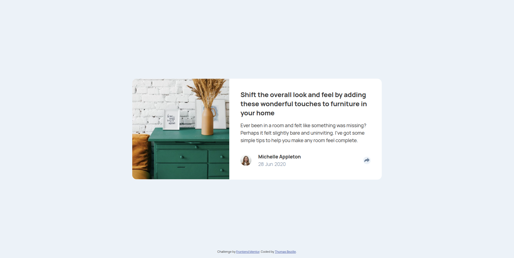
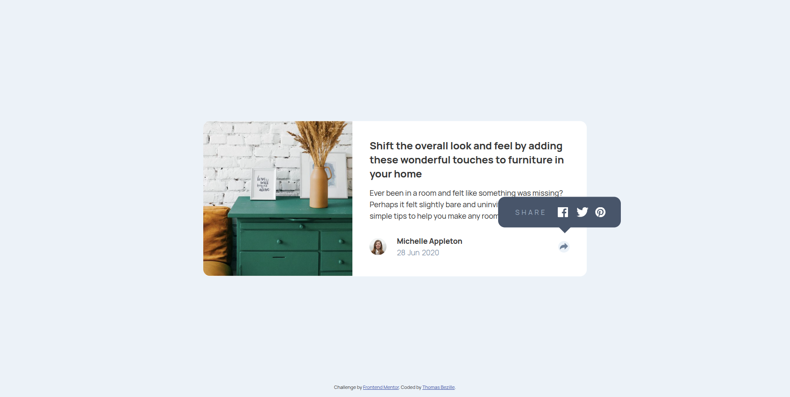
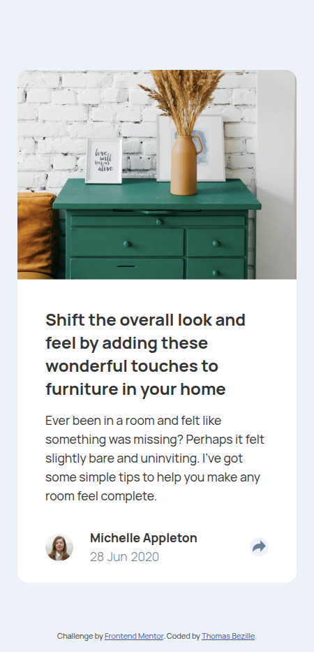
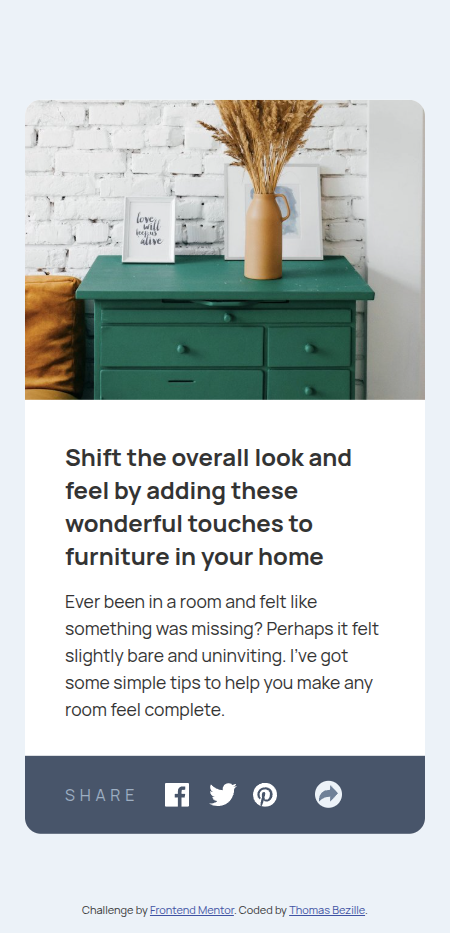

# Article preview component

> Une carte d'aperçu d'article responsive avec une fonctionnalité de partage interactive, permettant à l'utilisateur de révéler des liens de partage social d'un simple clic.






**🔗 [Demo en ligne](https://front-end-mentor-article-preview-co.vercel.app/)**

---

## 🎯 Objectif

Ce projet est une solution au challenge « Article preview component » proposé par Frontend Mentor. L'objectif était de reproduire fidèlement une maquette tout en gérant une interaction dynamique (l'affichage du panneau de partage). J'ai souhaité y pratiquer une approche mobile-first, une architecture SCSS structurée et la manipulation typée du DOM avec TypeScript.

**Ce que j'ai appris :**

- **HTML sémantique** : structuration claire et accessible du contenu
- **CSS / SCSS** : approche mobile-first, variables, nesting et organisation des styles
- **Responsive design** : adaptation des layouts mobile et desktop via les media queries
- **TypeScript** : manipulation typée du DOM et gestion des événements
- **Logique d'interaction** : gestion d'état pour l'affichage du panneau de partage
- **Workflow npm** : compilation du SCSS et du TypeScript via des scripts dédiés
- **Git** : versionnement structuré avec la convention Conventional Commits

---

## 🛠️ Stack


---

## 🚀 Lancer le projet

```bash
# Cloner le dépôt
git clone https://github.com/Thomas-Bezille/FrontEnd-Mentor_Article_preview_component.git
cd FrontEnd-Mentor_Article_preview_component

# Installer les dépendances
npm install

# Lancer en développement
npm run sass
tsc -w
# Ces commande surveille et compile automatiquement les fichiers SCSS et TypeScript à chaque modification.
Ouvre le fichier `index.html` avec **Live Server** (clic droit → _Open with Live Server_) pour visualiser le projet dans ton navigateur avec rechargement automatique.
```

---

## 👤 Contact

**Thomas Bezille** — Développeur web à Nantes

[](https://www.linkedin.com/in/thomas-bezille/)
[](https://github.com/Thomas-Bezille)
